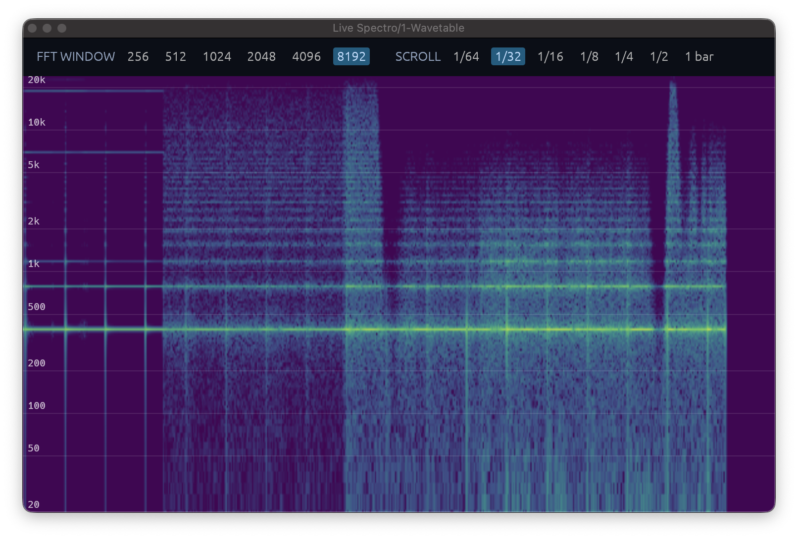

# LiveSpectroVST

Live Spectro is a real-time scrolling spectrogram audio effect VST.



## Features

- FFT sizes from 256 to 8192 samples
- Tempo-synced scrolling.
- Logarithmic frequency axis.
- Mono and stereo pass-through processing.
- VST3 and CLAP exports for macOS, Windows, and Linux

## Vibe Coded

This VST is vibecoded.

## Download

Prebuilt bundles are attached to tagged the releases.

## Build

Install the platform dependencies listed below, then run:

```sh
cargo xtask bundle live-spectro-vst --release
```

Bundles are written to `target/bundled/`.

### Linux dependencies

On Ubuntu/Debian:

```sh
sudo apt-get install libx11-dev libxcb1-dev libx11-xcb-dev libxcb-dri2-0-dev libgl1-mesa-dev \
  libxcb-icccm4-dev libxcursor-dev libxkbcommon-dev libxcb-shape0-dev \
  libxcb-xfixes0-dev
```

### macOS universal build

Install both Rust targets, then use the universal bundler command:

```sh
rustup target add aarch64-apple-darwin x86_64-apple-darwin
cargo xtask bundle-universal live-spectro-vst --release
```

## Install

- macOS VST3: `~/Library/Audio/Plug-Ins/VST3/`
- Windows VST3: `%LOCALAPPDATA%/Programs/Common/VST3/`
- Linux VST3: `~/.vst3/`

Copy the complete `.vst3` bundle, not only the library inside it. CLAP plugins
normally go in the corresponding platform CLAP directory.

## License

LiveSpectroVST is available under the [WTF Public License](LICENSE).
